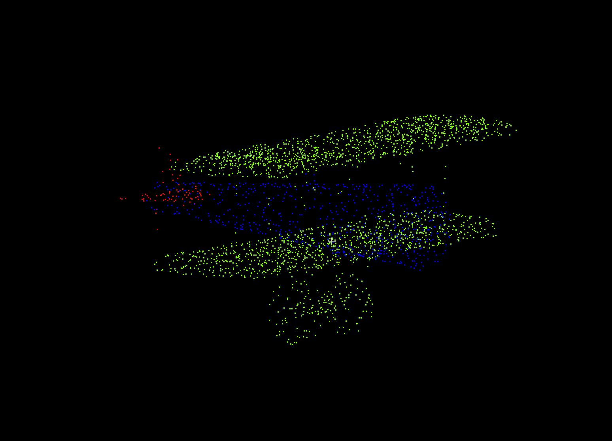

# PointCloud_Segmentation

## Table of Contents
- Project Description
- Environment setup
- Dataset download link
- Github Colabration workflow & Example

## Project Description

INF574 course Project: 
Implement from scratch the Model PointNet++(https://arxiv.org/abs/1706.02413) for point cloud segmentation. 

Collaborators: 
Tianyang HUANG, Haiyang JIANG

## Environment Setup
```shell
# required dependencies ------------------------
pip install -i requirements.txt


# not used or optional dependencies : --------------------
pip install mitsuba 
# for beautiful point could visualization
# source : https://mitsuba.readthedocs.io/en/stable/

pip install h5py
# parse h5 files (additional datasets)
```

## Data Preparation
Download alignment **ShapeNet** [here](https://shapenet.cs.stanford.edu/media/shapenetcore_partanno_segmentation_benchmark_v0_normal.zip) and
save in `data/shapenetcore_partanno_segmentation_benchmark_v0_normal/`.

Data folder structure (16 categories x, y, z, Nx, Ny, Nz)
```text
data/shapenetcore_partanno_segmentation_benchmark_v0_normal
  |
  |--02691156 : Airplane
  |--02773838 : Bag	
  |--02954340 : Cap
  |--02958343 : Car
  |--03001627 : Chair
  |--03261776 : Earphone
  |--03467517 : Guitar	
  |--03624134 : Knife	
  |--03636649 : Lamp
  |--03642806 : Laptop	
  |--03790512 : Motorbike
  |--03797390 : Mug	
  |--03948459 : Pistol
  |--04099429 : Rocket	
  |--04225987 : Skateboard	
  |--04379243 : Table
  |--train_test_split            # .json set partitions
  |--synsetoffset2category.txt   # categorical correspondances
```
Preview in CloudCompare : 


## Training 
```shell
 # multi-scale grouping implementation (default)
 python train.py  --use_normals --log_dir PointNetPP --device "cuda"

# multi-resolution grouping implementation (beta)
python train.py  --use_normals --model PointNetPPMRG --log_dir PointNetPPMRG --device "cuda"

```

## Additional Datasets Download link (not used):
Credits to : https://github.com/AnTao97/PointCloudDatasets

- ShapeNetCore.v2 (0.98G)&ensp;[[TsinghuaCloud]](https://cloud.tsinghua.edu.cn/f/06a3c383dc474179b97d/)&ensp;[[BaiduDisk]](https://pan.baidu.com/s/154As2kzHZczMipuoZIc0kg)
- ShapeNetPart (338M)&ensp;[[TsinghuaCloud]](https://cloud.tsinghua.edu.cn/f/c25d94e163454196a26b/)&ensp;[[BaiduDisk]](https://pan.baidu.com/s/1yi4bMVBE2mV8NqVRtNLoqw)
- ModelNet40 (194M)&ensp;[[TsinghuaCloud]](https://cloud.tsinghua.edu.cn/f/b3d9fe3e2a514def8097/)&ensp;[[BaiduDisk]](https://pan.baidu.com/s/1NQZgN8tvHVqQntxefcdVAg)
- ModelNet10 (72.5M)&ensp;[[TsinghuaCloud]](https://cloud.tsinghua.edu.cn/f/5414376f6afd41ce9b6d/)&ensp;[[BaiduDisk]](https://pan.baidu.com/s/1tfnKQ_yg3SfIgyLSwQ2E0g)

### ShapeNetCore.v2
ShapeNetCore.v2 datset contains 51,127 pre-aligned shapes from 55 categories, which are split into 35,708 (70%) for training, 5,158 (10%) shapes for validation and 10,261 (20%) shapes for testing. In official document there should be 51,190 shapes in total, but 63 shapes are missing in original downloaded ShapeNetCore.v2 dataset from [here](https://www.shapenet.org/download/shapenetcore). 

The 55 categories include: `airplane`, `bag`, `basket`, `bathtub`, `bed`, `bench`, `birdhouse`, `bookshelf`, `bottle`, `bowl`, `bus`, `cabinet`, `camera`, `can`, `cap`, `car`, `cellphone`, `chair`, `clock`, `dishwasher`, `earphone`, `faucet`, `file`, `guitar`, `helmet`, `jar`, `keyboard`, `knife`, `lamp`, `laptop`, `mailbox`, `microphone`, `microwave`, `monitor`, `motorcycle`, `mug`, `piano`, `pillow`, `pistol`, `pot`, `printer`, `remote_control`, `rifle`, `rocket`, `skateboard`, `sofa`, `speaker`, `stove`, `table`, `telephone`, `tin_can`, `tower`, `train`, `vessel`, `washer`.

### ShapeNetPart
ShapeNetPart dataset contains 16,881 pre-aligned shapes from 16 categories, annotated with 50 segmentation parts in total. Most object categories are labeled with two to five segmentation parts. There are 12,137 (70%) shapes for training, 1,870 (10%) shapes for validation, and 2,874 (20%) shapes for testing. We also pack the segementation label in our dataset. The link for official dataset is [here](https://shapenet.cs.stanford.edu/media/shapenet_part_seg_hdf5_data.zip).

The 16 categories include: `airplane`, `bag`, `cap`, `car`, `chair`, `earphone`, `guitar`, `knife`, `lamp`, `laptop`, `motorbike`, `mug`, `pistol`, `rocket`, `skateboard`, `table`.

Although ShapeNetPart is made from ShapeNetCore, the number of points per shape in official ShapeNetPart dataset is not very large and sometimes less than 2,048. Thus the uniform sampling quality of our ShapeNetPart dataset is lower than our ShapeNetCore.v2 dataset. 

In this dataset, we change segmentation label for each point into range 0~49 according to its category. You can find a index mapping list in `dataset.py`.

###  ModelNet40
ModelNet40 dataset contains 12,311 pre-aligned shapes from 40 categories, which are split into 9,843 (80%) for training and 2,468 (20%) for testing. The link for official dataset is [here](http://3dvision.princeton.edu/projects/2014/3DShapeNets/ModelNet10.zip).

The 40 categories include: `airplane`, `bathtub`, `bed`, `bench`, `bookshelf`, `bottle`, `bowl`, `car`, `chair`, `cone`, `cup`, `curtain`, `desk`, `door`, `dresser`, `flower_pot`, `glass_box`, `guitar`, `keyboard`, `lamp`, `laptop`, `mantel`, `monitor`, `night_stand`, `person`, `piano`, `plant`, `radio`, `range_hood`, `sink`, `sofa`, `stairs`, `stool`, `table`, `tent`, `toilet`, `tv_stand`, `vase`, `wardrobe`, `xbox`.

**Note**: The widely used 2,048 points sampled ModelNet40 dataset ([link](https://shapenet.cs.stanford.edu/media/modelnet40_ply_hdf5_2048.zip)) only contains 9,840 shapes for training, not 9,843 in official. Our ModelNet40 dataset fixs this problem and can substitute the above mentioned dataset perfectly.

### ModelNet10
ModelNet10 dataset is a part of ModelNet40 dataset, containing 4,899 pre-aligned shapes from 10 categories. There are 3,991 (80%) shapes for training and 908 (20%) shapes for testing. The link for official dataset is [here](http://modelnet.cs.princeton.edu/ModelNet40.zip).

The 10 categories include: `bathtub`, `bed`, `chair`, `desk`, `dresser`, `monitor`, `night_stand`, `sofa`, `table`, `toilet`.


## Github colabration workflow

```bash
# do once
git clone <repo in ssh>

# every time when opening the project
git pull # download updates from github to local 

# switch to personal repo
git checkout <branch name>

# check if you're in the right branch
git branch -l

>>>
  haiyang
  main
* tianyang

# commit 
git stauts # visualize modified and ignored files
git add <file names> # stage files for commiting 
git commit -m "commit message" # commit files in local
git push origin <branch name> # update github

# merge results on github using Pull request
# remember to add reviewer
Pull requests -> New Pull request
```

### Example
```shell
git pull 

git checkout tianyang

>>> 
Switched to branch 'tianyang'

### do some modifications in readme.md 
git status 

>>>
On branch tianyang
Changes not staged for commit:
  (use "git add <file>..." to update what will be committed)
  (use "git restore <file>..." to discard changes in working directory)
        modified:   README.md
Untracked files:
  (use "git add <file>..." to include in what will be committed)
        .idea/

git add README.md 
git commit -m "updated readme"

git push origin tianyang 
```


